# BOTSv3 Incident Analysis 

## Introduction

In everyday cybersecurity, a Security Operations Center (SOC) is essential for 24/7 threat detection and incident response. Because modern networks generate massive amounts of data, SOC teams rely on SIEM (Security Information and Event Management) systems like Splunk. These tools allow analysts to collect and analyse logs to spot suspicious activity that humans might otherwise miss.

The BOTSv3 (Boss of the SOC version 3) exercise simulates this realistic environment, allowing users to gain hands-on experience through "Capture the Flag" tasks. The investigation targets the digital infrastructure of a fictional brewery called "Frothly." This complex dataset gathers data from various services, including Amazon AWS, Microsoft Azure, and internal endpoint logs.

The objective of this SOC simulation is to complete the assigned set of BOTSv3’s “200-level” questions using Splunk Search Processing Language (SPL). The specific focus of this investigation is on AWS cloud infrastructure events (specifically IAM access and S3 bucket misconfigurations) and endpoint hardware analysis. The goal is to use the Cyber Kill Chain methodology to reconstruct the incident.The scope of this report is strictly limited to these assigned questions. It is assumed that the provided log data is accurate and serves as the single source of truth for this timeline.

---

## SOC Roles & Incident Handling Reflection

A professional SOC is usually structured into different levels to efficiently manage security alerts [1]. 

* **Level 1 Analysts:** Responsible for reviewing SIEM alerts to identify if they are false positives or genuine threats. 
* **Level 2 Analysts:** Handle escalated, high-priority incidents requiring deep investigation. 
* **Level 3 Analysts:** These are highly experienced analysts who search for threat indications (threat hunting), while the **SOC Manager** oversees operations and reports to the CISO. 

Additional roles include security engineers who are responsible for implementing security solutions and malware analysts who reverse engineer malware to improve security detection.

In this BOTSv3 exercise, I am simulating the responsibilities of a **Level 2/3 analyst**. I am not reacting to alerts like a level 1 analyst would; instead I am using Splunk SPL to search for indicators of compromise (IOCs) and reconstruct the attack timeline. 

This analysis follows the **NIST Incident Response Lifecycle** which has four connected stages [2]: 
1. **Prevention:** The incident stems from a failure in the Prevention phase, specifically due to Frothly's misconfigured AWS cloud permissions and inadequate access controls.
2. **Detection and Analysis:** This is the primary focus of the exercise. It involves interrogating Splunk logs to distinguish between benign network noise and genuine threats, confirming the scope of the breach.
3. **Response:** The analysis provides the details of the incident so that threats can be contained and eradicated at this stage. 
4. **Recovery:** This stage focusses on "lessons learned". By defining the root cause, patches can be implemented to ensure these specific vulnerabilities are not re-exploited. 

---

## Installation & Data Preparation

### Environment Setup

To facilitate this investigation, a localized Splunk Enterprise instance was deployed on an Ubuntu Virtual Machine. This approach mirrors a standard SOC analyst's sandbox environment, allowing for safe log analysis without impacting production servers.

1. Splunk Installation:
The Splunk Enterprise installer (.tgz) was retrieved via the github. The package was extracted to the /opt directory. This directory is the industry-standard location for unbundled software on Linux systems, ensuring that the security tools remain separate from the core operating system files.

```bash
# Commands used for installation
wget -O splunk-8.x.x-linux-2.6-amd64.tgz 'https://download.splunk.com/...'
sudo tar -xvzf splunk-*.tgz -C /opt
sudo /opt/splunk/bin/splunk start --accept-license
```

2. Service Initialization:
The Splunk service was started on localhost:8000.

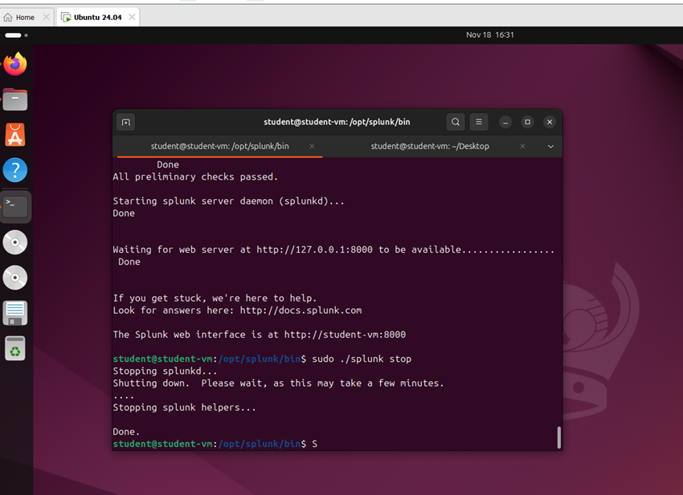

### Dataset Ingestion

The BOTSv3 dataset was retrieved from the official Splunk GitHub repository. Proper data ingestion is critical in a SOC to ensure time-stamps are parsed correctly and logs are searchable.

1. Retrieving Data:
The dataset was downloaded and extracted. In a real-world SOC, data is usually ingested via Forwarders, but for this simulation, the data was uploaded directly as a Splunk App.

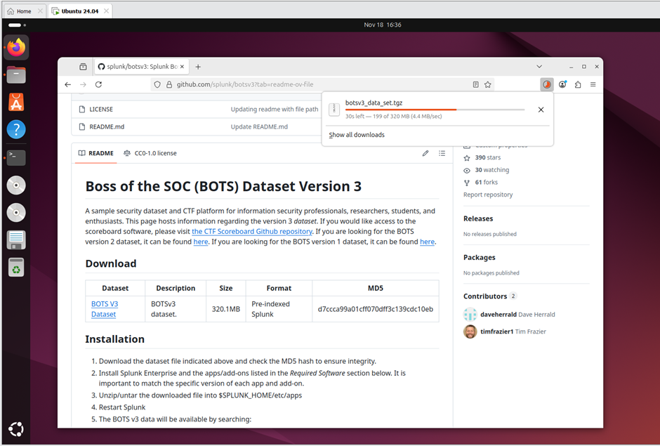
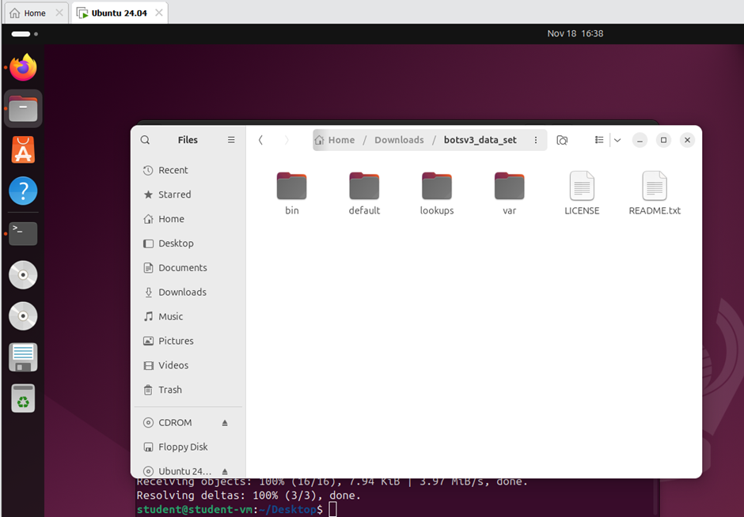

2.Indexing & App Configuration:
The extracted data folder was moved to the Splunk apps directory. This ensures that all the specific field extractions and sourcetypes for the BOTSv3 data are automatically applied when Splunk restarts.

```bash
# Command used to install the BOTSv3 App
cp -r botsv3_data_set /opt/splunk/etc/apps/
```
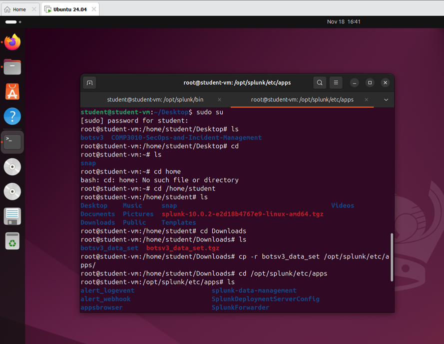

Segregating this data into its own index is best practice.

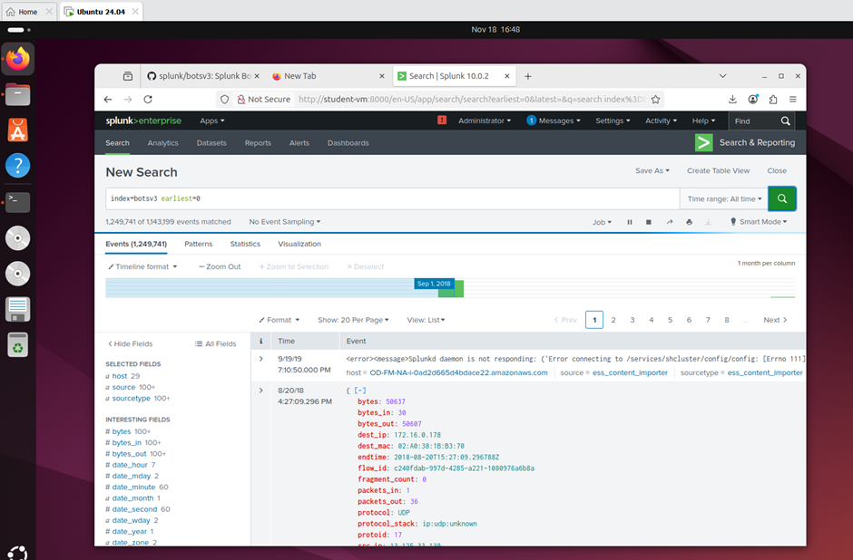

---

## Guided Questions

### Question 1: IAM Users Accessing Services

**Answer:** bstoll,btun,splunk_access,web_admin

**Methodology:** To identify IAM users accessing services within the Frothly AWS environment, I analysed AWS CloudTrail logs, which record API activity. I filtered the data for userIdentity.type='IAMUser' to isolate specific user actions and exclude automated AWS services. To summarize the findings, I used the stats command to group by userIdentity.userName and list the eventSource values. This transformed thousands of raw log lines into a clean, alphabetical table of users and their accessed services.

**Splunk Query:** ```index=botsv3 sourcetype="aws:cloudtrail" userIdentity.type="IAMUser"
| stats values(eventSource) by “Services Accessed” by userIdentity.userName ```

**SOC Relevance:** Monitoring IAM user activity is fundamental to cloud security. By auditing which users are accessing specific services, a SOC analyst can detect violations of the principle of least privilege (usrs accessing services irrelevant to their role) and identify anomaloud behviour that typically signals a compromised account.

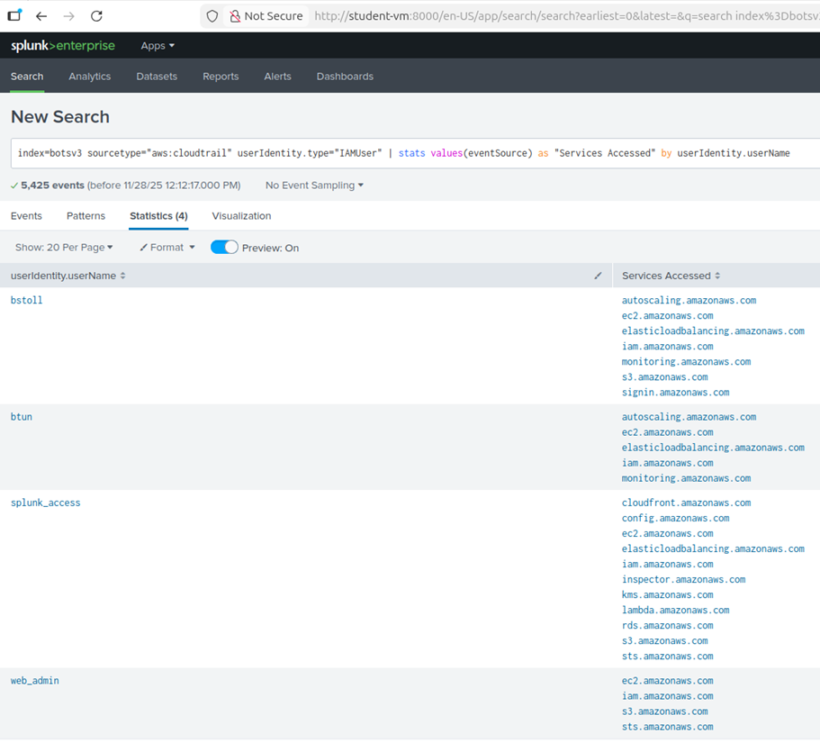

### Question 2: Missing MFA Field

**Answer:** userIdentity.sessionContext.attributes.mfaAuthenticated

**Methodology:** To identify AWS API activity occurring without Multi-Factor Authentication (MFA), I performed a keyword search using *mfa* against the aws:cloudtrail sourcetype. I explicitly excluded ConsoleLogin events to isolate programmatic API calls from web interface logins. This revealed the nested JSON path userIdentity.sessionContext.attributes.mfaAuthenticated. To verify, I ran a stats count on this field, which returned 2,155 instances where the value was false.

**Splunk Query:** ```index=botsv3 sourcetype="aws:cloudtrail" eventName!="ConsoleLogin" | stats count by userIdentity.sessionContext.attributes.mfaAuthenticated ```

**SOC Relevance:** MFA is a critical layer of security. SOC analysts need to monitor MFA for bypasses, credential compromises, and insider abuse, which could look like admins performing sensitive actions, which MFA cannot prevent on its own. 

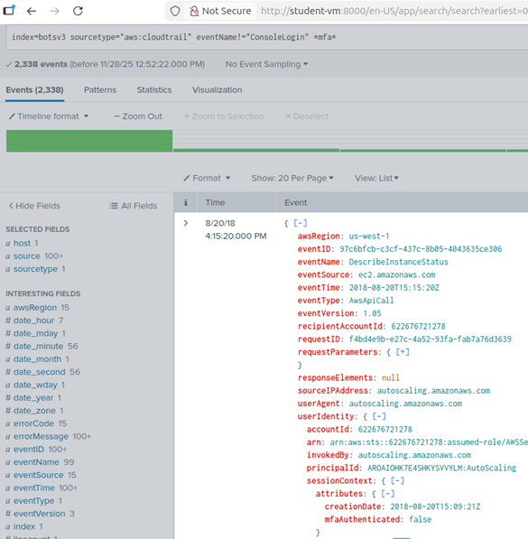
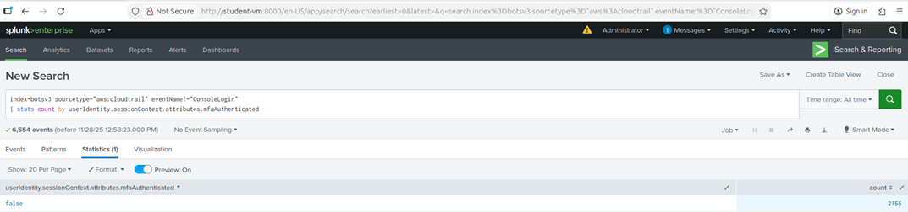

### Question 3: Web Server Processor

**Answer:** E5-2676 v3

**Methodology:** I started by searching index=botsv3 to explore the available data. I browsed the Sourcetype field list and identified a relevant sourcetype named hardware. Filtering for sourcetype="hardware" returned three events for hosts named gacrux. 

To verify that the 'gacrux' endpoints identified in the hardware logs were indeed the web servers, I analyzed the naming convention and cross-referenced the hostname with the access_combined sourcetype. This revealed that these hosts were generating Apache web logs. Furthermore, I observed high-frequency HTTP GET requests from the User-Agent 'ELB-HealthChecker/2.0'. This specific traffic pattern confirms that these instances are registered targets behind an AWS Elastic Load Balancer, actively serving HTTP traffic.

Returning to the hardware logs for gacrux, I found the CPU_TYPE listed as 'Intel Xeon CPU E5-2676 v3'.

**Splunk Query:** ```index=botsv3 sourcetype=”hardware” ``` ```index=botsv3 sourcetype="access_combined" host="gacrux.i-0920036c8ca91e501" http*```

**SOC Relevance:** An accurate Asset Inventory is a foundational SOC requirement. Understanding hardware allows analysts to distinguish between legitimate resource usage and malicious activity. For example, if a web server known to run high-performance CPUs (like the E5-2676) suddenly experiences 100% utilization during low-traffic periods, it is a strong indicator of Cryptojacking (unauthorized crypto-mining) or a Denial of Service (DoS) attack.

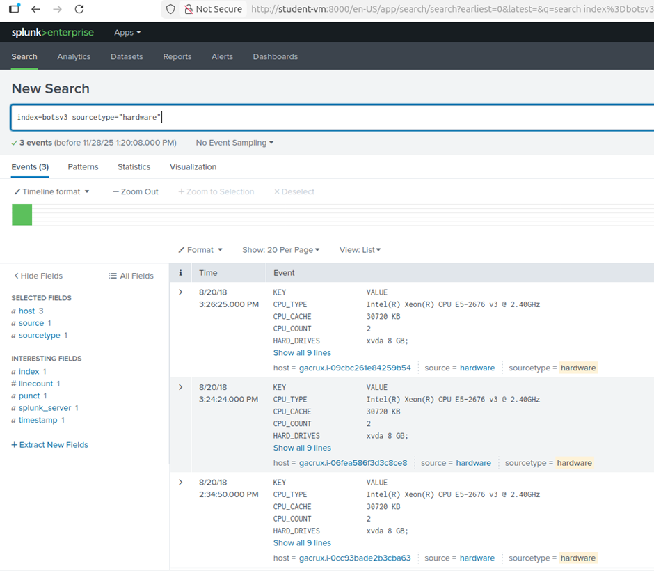
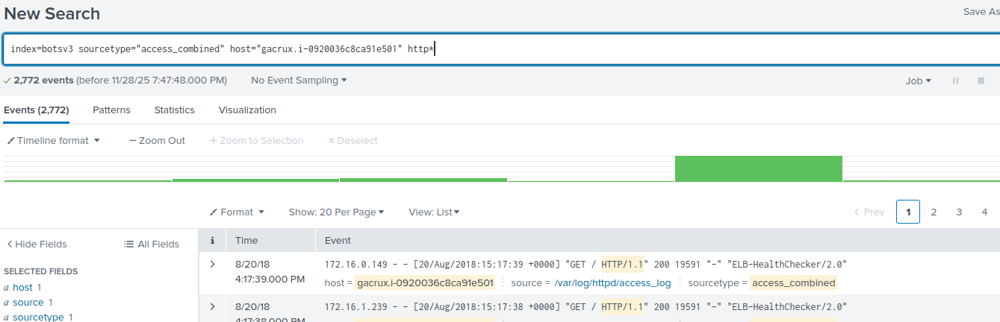

### Question 4: S3 Public Access Event ID

**Answer:** ab45689d-69cd-41e7-8705-5350402cf7ac

**Methodology:** To identify the specific API call from Bud that enabled public access, I began by searching for eventName='PutBucketAcl', which tracks changes to S3 bucket permissions. This returned two events. Instead of guessing, I analysed the 'Interesting Fields' sidebar to find parameters related to access control.

I discovered the field requestParameters.AccessControlPolicy.AccessControlList.Grant{}.Grantee.URI. Checking the values for this field, I spotted http://acs.amazonaws.com/groups/global/AllUsers - this AWS identifier for public access. I added this to my search to confirm the single relevant event, pointing to Event ID ab45689d-69cd-41e7-8705-5350402cf7ac.

**Splunk Query:**  ```index=botsv3 sourcetype="aws:cloudtrail" eventName="PutBucketAcl" ```
``` requestParameters.AccessControlPolicy.AccessControlList.Grant{}.Grantee.URI="http://acs.amazonaws.com/groups/global/AllUsers" ```

**SOC Relevance (Q4-6):** Misconfigured S3 buckets are a leading cause of data breaches. SOC analysts must set up real-time alerts for PutBucketAcl events that grant "AllUsers" access. Rapid detection allows the SOC to revoke public access before sensitive data is exfiltrated by scanners or bots. 

Further examination of the bucket also reveals the account that has set the bucket to public access. This allows analysts to pivot back to IAM logs (as seen in question 1) to determine if the user bstoll is a malicious insider or a victim of credential theft.

The bucket name is a useful indicator for the SOC to understand the sensitivity of the data. Frothlywebcode implies source code, whereas a bucket named frothly-payroll would imply PII. Knowing this allows analysts to searched dark web forums to see if the exposed URL is being shared by attackers. 

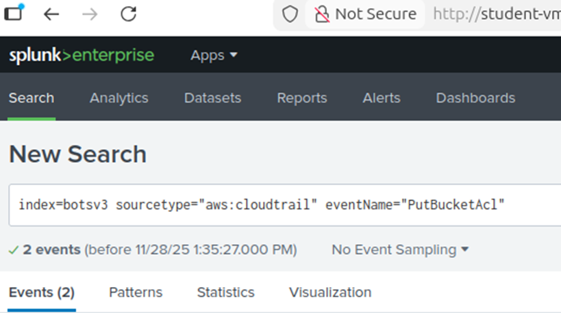
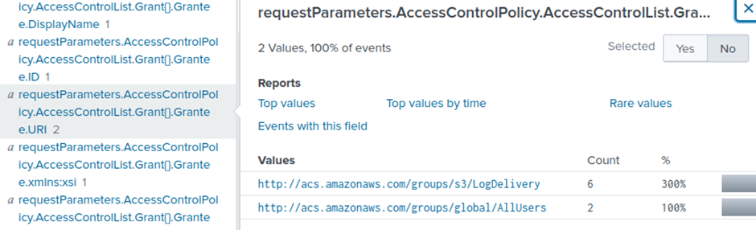
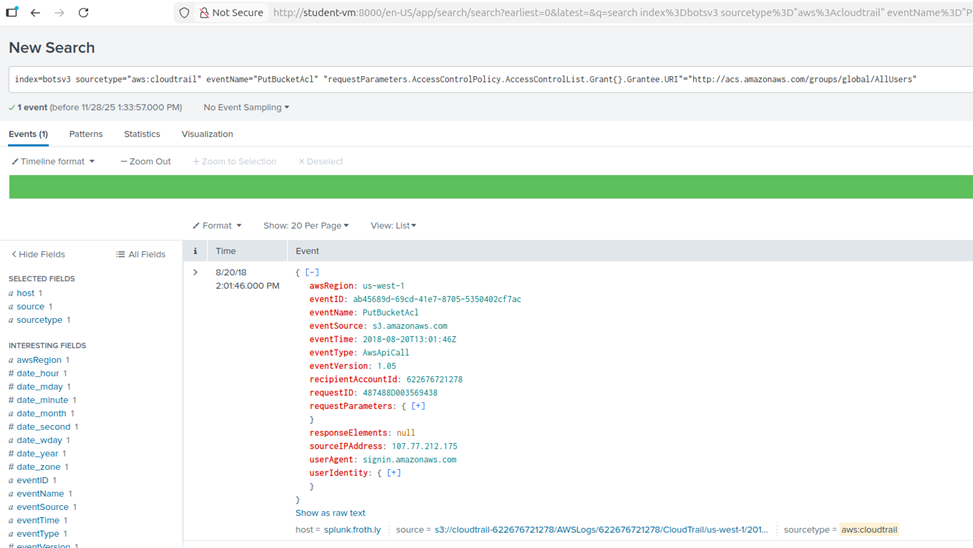

### Question 5: Bud's Username

**Answer:** bstoll

**Methodology:** Continuing the analysis of the JSON payload from the event identified in Question 4, I inspected the userIdentity object. This explicitly listed the userName of the actor who performed the action (setting the bucket to "AllUsers" access) as bstoll.

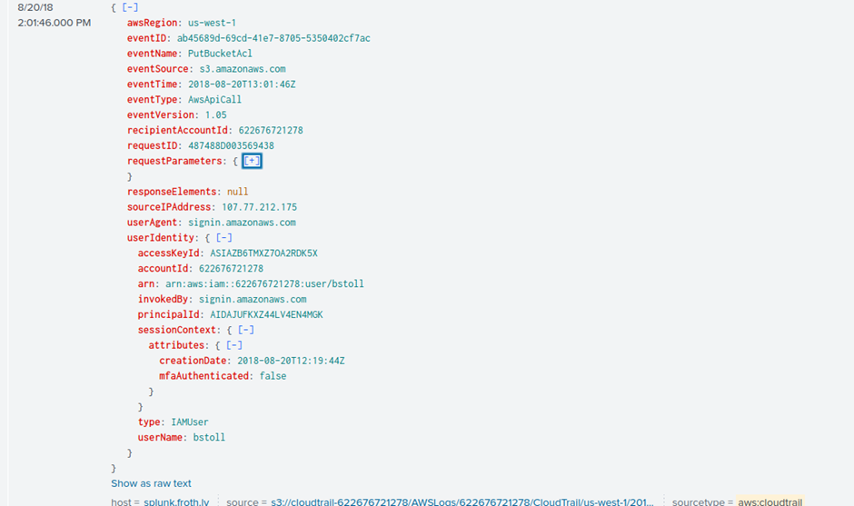

### Question 6: Compromised S3 Bucket Name

**Answer:** frothlywebcode

**Methodology:** Within the same PutBucketAcl event found in Question 4, I expanded the requestParameters section of the JSON. This identified the specific target resource, revealing the bucket name as frothlywebcode.

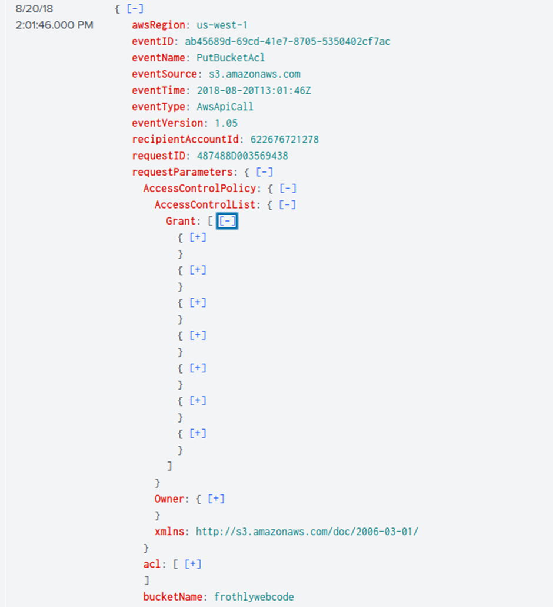

### Question 7: Uploaded Text File

**Answer:** OPEN_BUCKET_PLEASE_FIX.txt

**Methodology:** To locate the uploaded text file, I filtered for the sourcetype aws:s3:accesslogs and narrowed the search by filtering for the .txt file extension. This reduced the noise to just three events. To identify the specific file upload, I filtered for the PUT method (indicating a write operation). This isolated a single successful event, revealing the filename in the key field: OPEN_BUCKET_PLEASE_FIX.txt.

**Splunk Query:** index=botsv3 sourcetype="aws:s3:accesslogs" .txt PUT

**SOC Relevance:** Analyzing access logs for public buckets helps the SOC determine the impact of a breach. The specific use of the PUT method confirms the bucket was writable by the public. This triggers an immediate incident response workflow to scan the entire bucket for other uploaded artifacts, such as webshells, ransomware notes, or illegal content.

If this bucket serves assets for a website (e.g., images or JavaScript), an attacker could overwrite legitimate files to launch Cross-Site Scripting (XSS) attacks against customers.

In this case, the specific filename (OPEN_BUCKET_PLEASE_FIX.txt) indicates a "Gray Hat" actor scanning for vulnerabilities. However, a SOC must still treat this as a full breach, as the "open door" allowed anyone to enter. The SOC must validate that no other actors utilized the same vulnerability window to exfiltrate data (GET requests) or upload malware before the researcher arrived.

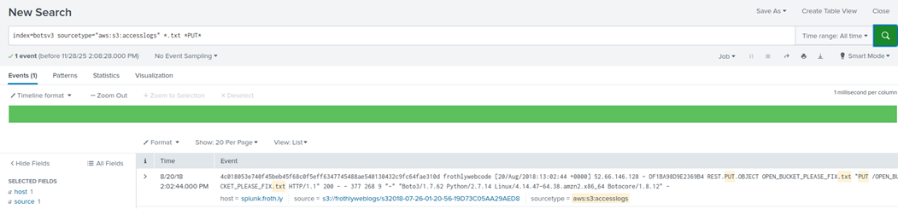

---

## Conclusion and Recommendations

---

## Video Presentation

---

## References

* [1] https://www.paloaltonetworks.co.uk/cyberpedia/soc-roles-and-responsibilities
* [2] https://auditboard.com/blog/nist-incident-response

---

## Apendix: Generative AI Declaration
