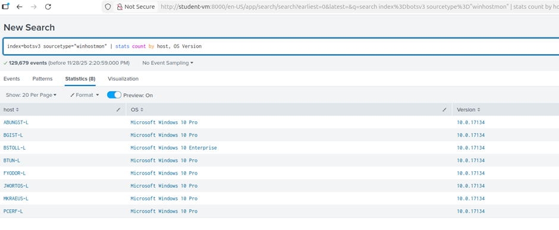
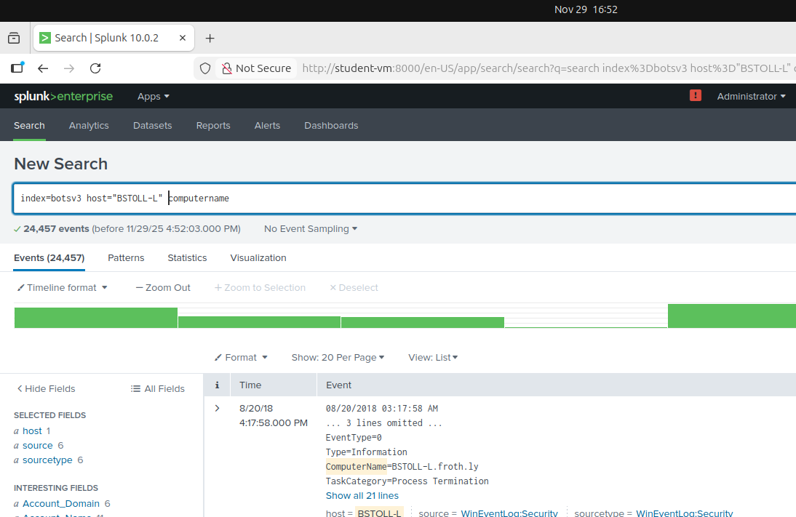

# BOTSv3 Incident Analysis 

## Introduction

Security Operations Centers (SOC) are essential for 24/7 threat detection. SOC teams rely on SIEM (Security Information and Event Management) systems like Splunk to collect and analyse logs, spotting suspicious activity that human analysis might miss.

The BOTSv3 (Boss of the SOC version 3) exercise simulates this environment through "Capture the Flag" tasks targeting the digital infrastructure of "Frothly”, a fictional brewery. This dataset gathers logs from various services, including Amazon AWS, Microsoft Azure, and internal endpoints.

The objective is to complete the “200-level” questions using Splunk Search Processing Language (SPL), focussing on AWS cloud infrastructure events (IAM access, S3 misconfigurations) and endpoint hardware analysis. This report uses the Cyber Kill Chain methodology to reconstruct the incident based on the provided log data.

---

## SOC Roles & Incident Handling Reflection

A professional SOC is tiered to manage alerts efficiently  [1]. 

* **Level 1 Analysts:** Responsible for reviewing SIEM alerts to identify if they are false positives or genuine threats. 
* **Level 2 Analysts:** Handle escalated, high-priority incidents requiring deep investigation. 
* **Level 3 Analysts:** These are highly experienced analysts who search for threat indications (threat hunting), while the **SOC Manager** oversees operations and reports to the CISO. 

Additional roles include security engineers who are responsible for implementing security solutions and malware analysts who reverse engineer malware to improve security detection.

In this exercise, I simulate a Level 2/3 analyst. Rather than reacting to alerts, I utilize Splunk SPL to proactively search for Indicators of Compromise (IOCs). This analysis follows the NIST Incident Response Lifecycle [2]: 

1. **Prevention:** The incident stems from a failure in the Prevention phase, specifically due to Frothly's misconfigured AWS cloud permissions and inadequate access controls.
2. **Detection and Analysis:** This is the primary focus of the exercise. It involves interrogating Splunk logs to distinguish between benign network noise and genuine threats, confirming the scope of the breach.
3. **Response:** The analysis provides the details of the incident so that threats can be contained and eradicated at this stage. 
4. **Recovery:** This stage focusses on "lessons learned". By defining the root cause, patches can be implemented to ensure these specific vulnerabilities are not re-exploited. 

---

## Installation & Data Preparation

### Environment Setup

A localized Splunk Enterprise instance was deployed on an Ubuntu Virtual Machine, mirroring a standard SOC analyst sandbox, allowing for safe log analysis without impacting production servers.

1. Splunk Installation:
The Splunk Enterprise installer (.tgz) was retrieved and extracted to the /opt directory. This directory is the industry-standard location for unbundled software on Linux systems, ensuring that the security tools remain separate from the core operating system files.

```bash
# Commands used for installation
wget -O splunk-8.x.x-linux-2.6-amd64.tgz 'https://download.splunk.com/...'
sudo tar -xvzf splunk-*.tgz -C /opt
sudo /opt/splunk/bin/splunk start --accept-license
```

2. Service Initialization:
The service was started on localhost:8000.


### Dataset Ingestion

The BOTSv3 dataset was retrieved from the official Splunk GitHub repository. Proper data ingestion is critical in a SOC to ensure time-stamps are parsed correctly and logs are searchable.

1. Retrieving Data:
The dataset was downloaded and extracted. In a real-world SOC, data is usually ingested via Forwarders, but for this simulation, the data was uploaded directly as a Splunk App.


2.Indexing & App Configuration:
The extracted data folder was moved to the Splunk apps directory. This ensures that all the specific field extractions and sourcetypes for the BOTSv3 data are automatically applied when Splunk restarts.

```bash
# Command used to install the BOTSv3 App
cp -r botsv3_data_set /opt/splunk/etc/apps/
```


Segregating this data into its own index is best practice.


---

## Guided Questions

### Question 1: IAM Users Accessing Services

By analysing AWS CloudTrail logs (userIdentity.type='IAMUser'), I isolated specific user actions from automated services. Using the stats command to group eventSource by userName revealed the users **bstoll,btun,splunk_access,web_admin** were accessing services.

Monitoring this is fundamental to cloud security; by auditing which users access specific services, analysts can detect violations of least privilege and identify anomalous behaviour that signals compromised accounts. 

```bash 
# Query: 
index=botsv3 sourcetype="aws:cloudtrail" userIdentity.type="IAMUser"
| stats values(eventSource) by “Services Accessed” by userIdentity.userName 

```


### Question 2: Missing MFA Field

To identify AWS API activity occurring without Multi-Factor Authentication (MFA), I performed a keyword search using *mfa* against the aws:cloudtrail sourcetype. I explicitly excluded ConsoleLogin events to isolate programmatic API calls from web interface logins. This revealed the nested JSON path **userIdentity.sessionContext.attributes.mfaAuthenticated**. To verify, I ran a stats count on this field, which returned 2,155 instances where the value was false.

MFA is a critical layer of security. SOC analysts need to monitor MFA for bypasses, credential compromises, and insider abuse, which could look like admins performing sensitive actions, which MFA cannot prevent on its own. This high volume of non-MFA activity represents a critical risk, as compromised credentials would grant an attacker full access without the secondary barrier of MFA.

```bash
# Query: 
index=botsv3 sourcetype="aws:cloudtrail" eventName!="ConsoleLogin" | stats count by userIdentity.sessionContext.attributes.mfaAuthenticated 
```


### Question 3: Web Server Processor

I browsed the Sourcetype field list and identified a relevant sourcetype named hardware. Filtering for sourcetype="hardware" returned three events for hosts named gacrux. 

To verify that the 'gacrux' endpoints identified in the hardware logs were indeed the web servers, I analysed the naming convention and cross-referenced the hostname with the access_combined sourcetype. This revealed that these hosts were generating Apache web logs. Furthermore, I observed high-frequency HTTP GET requests from the User-Agent 'ELB-HealthChecker/2.0'. This specific traffic pattern confirms that these instances are registered targets behind an AWS Elastic Load Balancer, actively serving HTTP traffic.

Returning to the hardware logs for gacrux, I found the CPU_TYPE listed as **Intel Xeon CPU E5-2676 v3**.

An accurate Asset Inventory is a foundational SOC requirement. Understanding hardware allows analysts to distinguish between legitimate resource usage and malicious activity. For example, if a web server known to run high-performance CPUs suddenly experiences 100% utilization during low-traffic periods, it is a strong indicator of Cryptojacking (unauthorized crypto-mining) or a Denial of Service (DoS) attack.

```bash
# Query: 
index=botsv3 sourcetype=”hardware” 
index=botsv3 sourcetype="access_combined" host="gacrux.i-0920036c8ca91e501" http*
```


### Question 4: S3 Public Access Event ID

To identify the specific API call from Bud that enabled public access, I began by searching for eventName='PutBucketAcl', which tracks changes to S3 bucket permissions. This returned two events. Instead of guessing, I analysed the 'Interesting Fields' sidebar to find parameters related to access control.

I discovered the field requestParameters.AccessControlPolicy.AccessControlList.Grant{}.Grantee.URI. Checking the values for this field, I spotted http://acs.amazonaws.com/groups/global/AllUsers - this AWS identifier for public access. I added this to my search to confirm the single relevant event, pointing to Event ID **ab45689d-69cd-41e7-8705-5350402cf7ac**.

Misconfigured S3 buckets are a leading cause of data breaches. SOC analysts must set up real-time alerts for PutBucketAcl events that grant "AllUsers" access. Rapid detection allows the SOC to revoke public access before sensitive data is exfiltrated by scanners or bots. 

```bash
# Query: 
index=botsv3 sourcetype="aws:cloudtrail" eventName="PutBucketAcl" 
requestParameters.AccessControlPolicy.AccessControlList.Grant{}.Grantee.URI="http://acs.amazonaws.com/groups/global/AllUsers" 
```


### Question 5: Bud's Username

Continuing the analysis of the JSON payload from the event identified in Question 4, I inspected the userIdentity object. This explicitly listed the userName of the actor who performed the action (setting the bucket to "AllUsers" access) as bstoll.
Further examination of the bucket to reveal the account that has set the bucket to public access, allows analysts to pivot back to IAM logs (as seen in question 1) to determine if the user bstoll is a malicious insider or a victim of credential theft.


### Question 6: Compromised S3 Bucket Name

Within the same PutBucketAcl event found in Question 4, I expanded the requestParameters section of the JSON. This identified the specific target resource, revealing the bucket name as frothlywebcode.

The bucket name is a useful indicator for the SOC to understand the sensitivity of the data. Frothlywebcode implies source code, whereas a bucket named frothly-payroll would imply PII. Knowing this allows analysts to searched dark web forums to see if the exposed URL is being shared by attackers. 


### Question 7: Uploaded Text File

To locate the uploaded text file, I filtered for the sourcetype aws:s3:accesslogs and narrowed the search by filtering for the .txt file extension. This reduced the noise to just three events. To identify the specific file upload, I filtered for the PUT method (indicating a write operation). This isolated a single successful event, revealing the filename in the key field: OPEN_BUCKET_PLEASE_FIX.txt.

I tried to investigate further and work out who uploaded the file to the bucket, however there was no endpoint device or IAM user that the upload was mapped to. 

Analysing access logs for public buckets helps the SOC determine the impact of a breach. The specific use of the PUT method confirms the bucket was writable by the public. This triggers an immediate incident response workflow to scan the entire bucket for other uploaded artifacts, such as webshells, ransomware notes, or illegal content.

If this bucket serves assets for a website (e.g., images or JavaScript), an attacker could overwrite legitimate files to launch Cross-Site Scripting (XSS) attacks against customers.

In this case, the specific filename indicates a "Gray Hat" actor scanning for vulnerabilities. However, a SOC must still treat this as a full breach, as the "open door" allowed anyone to enter. The SOC must validate that no other actors utilized the same vulnerability window to exfiltrate data (GET requests) or upload malware before the researcher arrived.

```bash
# Query: 
index=botsv3 sourcetype="aws:s3:accesslogs" .txt PUT 
```


### Question 8: FQDN of Unique Endpoint

To find the FQDN of the endpoint running a unique operating system, I used the sourcetype winhostmon. I then grouped the results by host and operating system, which revealed 8 different hosts. While the others were running Microsoft Windows 10 Pro, I identified one outlier running a different OS: BSTOLL-L, which uses Microsoft Windows 10 Enterprise. 

However, the standard host field only provided the short hostname, leaving the domain uncertain. To resolve this, I performed some investigative digging through the raw log entries for BSTOLL-L. After scanning through the event details, I located the ComputerName field, which explicitly listed the full network path as BSTOLL-L.froth.ly.

Identifying outliers in asset configurations is key to detecting high-risk assets. Personal laptops connected to the corporate network often lack standard security controls (patching/EDR), creating a soft entry point for attackers. 

The "Enterprise" edition on a laptop typically implies an Administrative or Developer machine. These endpoints are high-priority targets for attackers because they often contain hardcoded credentials or direct access to production environments.

```bash
# Query: 
index=botsv3 sourcetype="WinHostMon" | stats count by host, OS Version 
index=botsv3 host="BSTOLL-L" computername
```




---

## Conclusion and Recommendations

The investigation successfully reconstructed the incident timeline using Splunk logs.  It was determined that the user bstoll (Bud), operating from the endpoint BSTOLL-L, modified the AWS environment configuration. This change resulted in the S3 bucket frothlywebcode being set to "All Users," granting full public access. This exposure was detected and exploited by an unidentified external actor who uploaded a file named OPEN_BUCKET_PLEASE_FIX.txt.

While the nature of the uploaded file indicates a "Gray Hat" warning rather than a malicious attack, this vulnerability represents a critical failure. A malicious actor could have utilized this same access for data exfiltration, ransomware injection, or code corruption.

The investigation highlighted a significant lack of security controls. The account bstoll demonstrated a failure to enforce Multi-Factor Authentication (MFA). Had MFA been active, it would have served as a secondary barrier even if credentials were compromised. Furthermore, the endpoint BSTOLL-L is running Windows 10 Enterprise; this suggests the user holds a high-privilege role (such as an Administrator or Developer), making the lack of security controls on this account a high-risk vulnerability.

To remediate this incident and prevent reoccurrence, the following actions are recommended:
* Immediate Containment: Revoke public access to the frothlywebcode bucket immediately and perform a full audit of the bucket contents to ensure no other malicious artifacts (e.g., webshells) were uploaded.
* Credential Rotation: Reset the credentials for user bstoll immediately, treating the account as compromised.
* Enforce MFA: Implement a strict policy requiring MFA for all IAM users, specifically enforcing it for API and CLI access, not just console logins.
* Least Privilege Review: Conduct an audit of all IAM roles to ensure users like bstoll possess only the permissions necessary for their operational duties.

---

## Video Presentation

---

## References

* [1] https://www.paloaltonetworks.co.uk/cyberpedia/soc-roles-and-responsibilities
* [2] https://auditboard.com/blog/nist-incident-response

---

## Apendix: Generative AI Declaration
